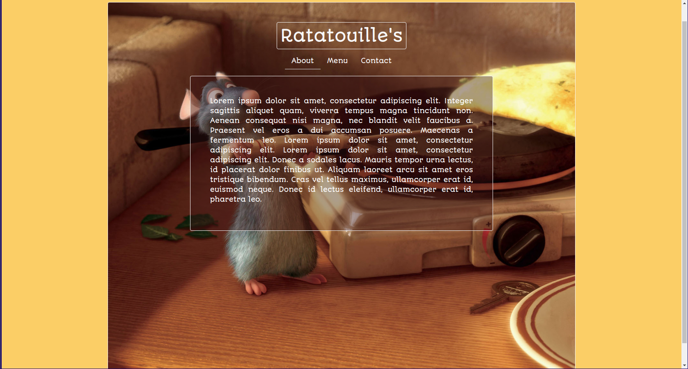

# Restaurant Page

> This is a dynamically rendered simple restaurant home page. In this project I used JavaScript alone to generate the entire contents of the website! [Odin project description](https://www.theodinproject.com/courses/javascript/lessons/restaurant-page)

## Built With

- JavaScript, HTML & CSS
- Bootstrap 4

## Live Demo

[Live Demo Link](https://rawcdn.githack.com/trekab/restaurant-page/535b05c36e2adec6d84abb27e9ecdd2d007bd1e7/dist/index.html)

## Getting Started

To get a local copy up and running follow these simple example steps.

To get a local copy up and running follow these simple example steps.
- git clone git@github.com:trekab/restaurant-page.git

Then you browse to the folder with:
- cd restaurant-page

Then you browse to the folder with:
- cd dist
- double click on the index.html file to open page in your browser.

## Authors

👤 **Treasure Kabareebe**

- Github: [@trekab](https://github.com/trekab)
- Twitter: [@TKabareebe](https://twitter.com/TKabareebe)
- Linkedin: [Treasure Kabareebe](https://www.linkedin.com/in/treasure-kabareebe/)

## 🤝 Contributing

Contributions, issues and feature requests are welcome!

Feel free to check the [issues page](issues/).

## Show your support

Give a ⭐️ if you like this project!

## Acknowledgments

- Hat tip to anyone whose code was used
- Inspiration
- etc

## 📝 License

This project is [MIT](lic.url) licensed.